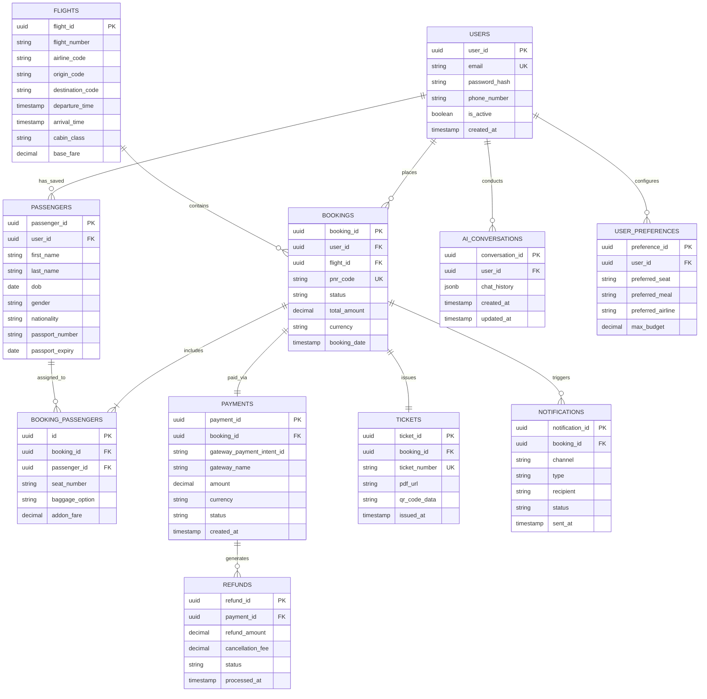

# AI-Powered Flight Ticket Booking Application - Project Workflow & ER Diagram Specification

This document contains:
1. **Complete Project Workflow Flowchart**: Adheres strictly to standard flowchart shape rules, swimlanes, directional arrows, and decision branches.
2. **PostgreSQL Entity-Relationship (ER) Diagram**: Features all 11 core database entities, primary/foreign key relationships, and data attributes.

---

## Flowchart Shape Notation Standard
* **ELLIPSE / STADIUM (`([ ... ])`)**: `START`, `END`, `BOOKING COMPLETED`, `Process Terminated`.
* **PARALLELOGRAM (`[/ ... /]`)**: All Inputs and Outputs (`INPUT: ...`, `OUTPUT: ...`).
* **RECTANGLE (`[ ... ]`)**: All functions and processing operations (`login_user()`, `validate_request()`, `create_booking()`, etc.).
* **DIAMOND (`{ ... }`)**: Conditional decision blocks with explicit `-- YES --->` and `-- NO --->` branches.
* **DATABASE CYLINDER (`[( ... )]`)**: PostgreSQL DB (11 entities) and Redis Cache.
* **EXTERNAL CLOUD / SYSTEM (`[☁️ ... ]`)**: External Flight Provider API, Payment Gateway, Email Service, SMS Service.
* **SWIMLANES**: 7 distinct structural layers (User, Frontend, Backend, AI Agent, MCP Layer, External Services, Data & Cache).

---

## 1. Complete End-to-End Project Workflow Diagram

```mermaid
flowchart TD
    %% =========================================================================
    %% SWIMLANE 1: USER (INPUTS / OUTPUTS / ACTIONS)
    %% =========================================================================
    subgraph SWIM_USER ["SWIMLANE 1: USER"]
        ST_START(["START"])
        N_OPEN_APP["User Opens Flight Booking Application"]
        
        N_IN_LOGIN[/"INPUT: User Registration / Login Details"/]
        N_OUT_AUTH_FAIL[/"OUTPUT: Invalid Credentials"/]
        
        N_USER_CHOICE{"Search using AI Agent?"}
        
        N_IN_MANUAL_SEARCH[/"INPUT: Flight Search Details
        (Origin, Dest, Departure, Return, Trip Type, Passengers, Class, Budget, Stops)"/]
        N_OUT_INVALID_SEARCH[/"OUTPUT: Invalid Search Details"/]
        
        N_IN_AI_PROMPT[/"INPUT: Natural Language Flight Request
        'Find the cheapest flight from Chennai to Delhi tomorrow'"/]
        N_OUT_AI_UNVAL[/"OUTPUT: Unable to understand request"/]
        N_IN_AI_MISSING[/"INPUT: Missing Information"/]
        
        N_OUT_RECOMMENDED[/"OUTPUT: Recommended Flights"/]
        N_IN_SELECT_FLIGHT[/"INPUT: User Selects Flight"/]
        N_OUT_UNAVAIL[/"OUTPUT: Flight No Longer Available"/]
        N_OUT_UPDATED_FARE[/"OUTPUT: Updated Fare"/]
        N_USER_ACCEPT_FARE{"User accepts new fare?"}
        
        N_IN_PASSENGER[/"INPUT: Passenger Details
        (First Name, Last Name, DOB, Gender, Nationality, Passport, Contact)"/]
        N_OUT_PASSENGER_ERR[/"OUTPUT: Invalid Passenger Details"/]
        
        N_OUT_SEAT_MAP[/"OUTPUT: Available Seat Map"/]
        N_IN_SEAT[/"INPUT: Selected Seat"/]
        
        N_IN_BAGGAGE[/"INPUT: Select Baggage"/]
        N_OUT_BOOKING_REVIEW[/"OUTPUT: Booking Summary
        (Flight, Passenger, Seat, Baggage, Fare, Taxes, Total)"/]
        N_USER_CONFIRM_BOOK{"User confirms booking?"}
        
        N_IN_PAYMENT[/"INPUT: Payment"/]
        N_OUT_PAY_FAIL[/"OUTPUT: Payment Failed"/]
        N_RETRY_PAY_COND{"Retry payment?"}
        
        N_OUT_CONFIRMATION[/"OUTPUT: Booking Confirmation / Ticket"/]
        ST_BOOK_COMPLETED(["BOOKING COMPLETED"])
        ST_END(["END"])

        %% My Bookings & Cancellation Inputs/Outputs
        N_IN_CANCEL_REQ[/"INPUT: Cancellation Request"/]
        N_OUT_REFUND_AMT[/"OUTPUT: Refund Amount"/]
        N_USER_CONFIRM_CANCEL{"User confirms cancellation?"}
        N_OUT_CANCEL_CONFIRM[/"OUTPUT: Cancellation & Refund Confirmation"/]
        N_OUT_CANCEL_FAIL[/"OUTPUT: Cancellation Failed"/]

        %% General Error Output
        N_OUT_GENERIC_ERR[/"OUTPUT: Error Message"/]
    end

    %% =========================================================================
    %% SWIMLANE 2: FRONTEND (React + TypeScript + Tailwind CSS)
    %% =========================================================================
    subgraph SWIM_FE ["SWIMLANE 2: FRONTEND (React + TS + Tailwind CSS)"]
        F_HOME["Flight Booking Home"]
        F_DISP_SEARCH["Display Flight Results"]
        F_SHOW_SEAT_MAP["Show Seat Map Again"]
        F_EDIT_BOOKING["Edit Booking"]
        F_MY_BOOKINGS["view_booking() Page"]
        F_DISP_BOOKING_DET[/"OUTPUT: Booking Details"/]
    end

    %% =========================================================================
    %% SWIMLANE 3: BACKEND (Python + FastAPI)
    %% =========================================================================
    subgraph SWIM_BE ["SWIMLANE 3: BACKEND (Python + FastAPI)"]
        B_REG["register_user()"]
        B_USER_REG_COND{"User already registered?"}
        B_CREATE_ACC["Create User Account"]
        B_VERIFY_EM["verify_email()"]
        B_LOGIN["login_user()"]
        B_AUTH_USER["authenticate_user()"]
        B_AUTH_COND{"Authentication successful?"}
        B_RETRY_LOGIN_COND{"Retry Login?"}
        B_SESSION["Create / Validate Session"]
        
        B_VAL_SEARCH["validate_request()"]
        B_SEARCH_COND{"Search parameters valid?"}
        B_SEARCH_FLIGHTS["search_flights()"]
        B_CHECK_CACHE["check_cache()"]
        B_CACHE_COND{"Cache available?"}
        
        B_GET_FLIGHT_DET["get_flight_details()"]
        B_CHECK_AVAIL{"Flight available?"}
        B_CHECK_FARE["check_fare()"]
        B_FARE_COND{"Fare changed?"}
        
        B_VAL_PASSENGER["validate_passenger()"]
        B_PASS_COND{"Passenger details valid?"}
        
        B_GET_SEATS["get_available_seats()"]
        B_VAL_SEAT["validate_seat()"]
        B_SEAT_COND{"Seat available?"}
        B_CONFIRM_SEAT["confirm_seat()"]
        
        B_GET_BAGGAGE["get_baggage_options()"]
        B_CALC_BAGGAGE["calculate_baggage_cost()"]
        B_UPDATE_TOTAL["update_booking_total()"]
        B_CALC_TOTAL["calculate_total()"]
        
        B_GEN_PNR["generate_pnr()"]
        B_GEN_TICKET["generate_ticket()"]
        B_GEN_PDF["generate_ticket_pdf()"]
        
        B_GET_BOOKING["get_booking()"]
        B_CHECK_STATUS["check_booking_status()"]
        B_GET_POLICY["get_cancellation_policy()"]
        B_CALC_REFUND["calculate_refund()"]
        B_CANCEL_BOOKING["cancel_booking()"]

        B_HANDLE_ERR["handle_error()"]
        B_LOG_ERR["log_error()"]
        B_RETRY_ERR_COND{"Retry possible?"}
        B_OP_SUCCESS_COND{"Operation successful?"}
    end

    %% =========================================================================
    %% SWIMLANE 4: AI AGENT ENGINE
    %% =========================================================================
    subgraph SWIM_AI ["SWIMLANE 4: AI AGENT ENGINE"]
        A_PROC["process_ai_request()"]
        A_INTENT["extract_intent()"]
        A_INTENT_COND{"Intent identified?"}
        A_PARAM["extract_parameters()"]
        A_PARAM_COND{"Required information available?"}
        A_VAL_PARAM["validate_parameters()"]
        A_PLAN["create_agent_plan()"]
        A_SEL_TOOL["select_mcp_tool()"]
        A_ANALYSIS["analyze_tool_result()"]
        A_RANK["rank_flights()"]
        A_COMPARE["Compare Price / Duration / Stops / Preferences"]
    end

    %% =========================================================================
    %% SWIMLANE 5: MODEL CONTEXT PROTOCOL (MCP) LAYER
    %% =========================================================================
    subgraph SWIM_MCP ["SWIMLANE 5: MCP LAYER"]
        M_CLIENT["MCP Client"]
        M_TOOL_COND{"Which MCP tool is required?"}
        
        M_FLIGHT_MCP["Flight MCP Server
        • search_flights()
        • get_flight_details()
        • check_availability()
        • get_fare_rules()
        • get_baggage_policy()"]
        
        M_BOOKING_MCP["Booking MCP Server
        • create_booking()
        • get_booking()
        • cancel_booking()
        • change_booking()
        • get_booking_status()"]
        
        M_PAYMENT_MCP["Payment MCP Server
        • create_payment()
        • verify_payment()
        • get_payment_status()
        • create_refund()"]
        
        M_PAY_CREATE["create_payment()"]
        M_PAY_VERIFY["verify_payment()"]
        M_PAY_COND{"Payment successful?"}
        
        M_BOOK_CREATE["create_booking()"]
        M_BOOK_CONFIRM["Booking Confirmation"]
        
        M_REFUND_CREATE["create_refund()"]
        M_CANCEL_MCP_COND{"Cancellation successful?"}
    end

    %% =========================================================================
    %% SWIMLANE 6: EXTERNAL SERVICES
    %% =========================================================================
    subgraph SWIM_EXT ["SWIMLANE 6: EXTERNAL SERVICES"]
        E_GDS["☁️ Flight API / Flight Provider
        • Search Flights
        • Check Availability
        • Get Fare
        • Get Flight Details
        • Create Booking
        • Cancel Booking
        • Change Booking"]
        
        E_GATEWAY["☁️ Payment Gateway
        (Stripe / Razorpay)"]
        
        E_NOTIF["Notification Service
        • send_booking_confirmation()
        • send_payment_confirmation()
        • send_ticket()"]
        
        E_EMAIL["☁️ Email Service"]
        E_SMS["☁️ SMS Service"]
    end

    %% =========================================================================
    %% SWIMLANE 7: DATA & CACHE
    %% =========================================================================
    subgraph SWIM_DATA ["SWIMLANE 7: DATA & CACHE"]
        D_REDIS[("Redis Cache
        • Flight search cache
        • Session / cache
        • Temporary booking state
        • Rate limiting
        • Short-lived data")]
        
        D_POSTGRES[("PostgreSQL Database
        • Users
        • Passengers
        • Flights
        • Bookings
        • Booking Passengers
        • Payments
        • Tickets
        • Refunds
        • Notifications
        • AI Conversations
        • User Preferences")]
    end

    %% =========================================================================
    %% 1. START & REGISTRATION / LOGIN FLOW
    %% =========================================================================
    ST_START ---> N_OPEN_APP
    N_OPEN_APP ---> N_IN_LOGIN
    N_IN_LOGIN ---> B_LOGIN
    B_LOGIN ---> B_USER_REG_COND
    
    B_USER_REG_COND -- NO ---> B_CREATE_ACC
    B_CREATE_ACC ---> B_VERIFY_EM
    B_VERIFY_EM ---> B_LOGIN
    
    B_USER_REG_COND -- YES ---> B_LOGIN
    B_LOGIN ---> B_AUTH_USER
    B_AUTH_USER ---> B_AUTH_COND
    
    B_AUTH_COND -- NO ---> N_OUT_AUTH_FAIL
    N_OUT_AUTH_FAIL ---> B_RETRY_LOGIN_COND
    B_RETRY_LOGIN_COND -- YES ---> N_IN_LOGIN
    B_RETRY_LOGIN_COND -- NO ---> ST_END
    
    B_AUTH_COND -- YES ---> B_SESSION
    B_SESSION ---> F_HOME

    %% =========================================================================
    %% 2. HOME PAGE & SEARCH MODE ROUTING
    %% =========================================================================
    F_HOME ---> N_USER_CHOICE
    
    N_USER_CHOICE -- NO ---> N_IN_MANUAL_SEARCH
    N_USER_CHOICE -- YES ---> N_IN_AI_PROMPT

    %% =========================================================================
    %% 3. MANUAL FLIGHT SEARCH
    %% =========================================================================
    N_IN_MANUAL_SEARCH ---> B_VAL_SEARCH
    B_VAL_SEARCH ---> B_SEARCH_COND
    
    B_SEARCH_COND -- NO ---> N_OUT_INVALID_SEARCH
    N_OUT_INVALID_SEARCH ---> N_IN_MANUAL_SEARCH
    
    B_SEARCH_COND -- YES ---> B_SEARCH_FLIGHTS
    B_SEARCH_FLIGHTS ---> B_CHECK_CACHE
    B_CHECK_CACHE ---> B_CACHE_COND

    %% =========================================================================
    %% 4. REDIS CACHE FLOW
    %% =========================================================================
    B_CACHE_COND -- YES ---> D_REDIS
    D_REDIS -- Read Cached Results ---> F_DISP_SEARCH
    
    B_CACHE_COND -- NO ---> M_FLIGHT_MCP
    M_FLIGHT_MCP -- search_flights() ---> E_GDS
    E_GDS -- Flight Inventory / Results ---> M_FLIGHT_MCP
    M_FLIGHT_MCP -- Write Results ---> D_REDIS
    D_REDIS ---> F_DISP_SEARCH
    F_DISP_SEARCH ---> N_IN_SELECT_FLIGHT

    %% =========================================================================
    %% 5. AI AGENT FLOW
    %% =========================================================================
    N_IN_AI_PROMPT ---> A_PROC
    A_PROC ---> A_INTENT
    A_INTENT ---> A_INTENT_COND
    
    A_INTENT_COND -- NO ---> N_OUT_AI_UNVAL
    N_OUT_AI_UNVAL ---> N_IN_AI_PROMPT
    
    A_INTENT_COND -- YES ---> A_PARAM
    A_PARAM ---> A_PARAM_COND
    
    A_PARAM_COND -- NO ---> N_IN_AI_MISSING
    N_IN_AI_MISSING ---> A_PROC
    
    A_PARAM_COND -- YES ---> A_VAL_PARAM
    A_VAL_PARAM ---> A_PLAN
    A_PLAN ---> A_SEL_TOOL
    A_SEL_TOOL ---> M_CLIENT

    %% =========================================================================
    %% 6. MCP CLIENT FLOW
    %% =========================================================================
    M_CLIENT ---> M_TOOL_COND
    
    M_TOOL_COND -- Flight search ---> M_FLIGHT_MCP
    M_TOOL_COND -- Booking ---> M_BOOKING_MCP
    M_TOOL_COND -- Payment ---> M_PAYMENT_MCP

    %% =========================================================================
    %% 7. FLIGHT MCP SERVER & 8. AI RESULT ANALYSIS
    %% =========================================================================
    M_FLIGHT_MCP -- search_flights() ---> E_GDS
    E_GDS -- Flight Inventory / Results ---> M_FLIGHT_MCP
    M_FLIGHT_MCP ---> M_CLIENT
    M_CLIENT ---> A_PROC
    
    A_PROC ---> A_ANALYSIS
    A_ANALYSIS ---> A_RANK
    A_RANK ---> A_COMPARE
    A_COMPARE ---> N_OUT_RECOMMENDED
    N_OUT_RECOMMENDED ---> F_DISP_SEARCH

    %% =========================================================================
    %% 9. FLIGHT SELECTION & AVAILABILITY / FARE CHECK
    %% =========================================================================
    N_IN_SELECT_FLIGHT ---> B_GET_FLIGHT_DET
    B_GET_FLIGHT_DET ---> M_FLIGHT_MCP
    M_FLIGHT_MCP -- check_availability() ---> E_GDS
    E_GDS ---> B_CHECK_AVAIL
    
    B_CHECK_AVAIL -- NO ---> N_OUT_UNAVAIL
    N_OUT_UNAVAIL ---> N_IN_MANUAL_SEARCH
    
    B_CHECK_AVAIL -- YES ---> B_CHECK_FARE
    B_CHECK_FARE ---> B_FARE_COND
    
    B_FARE_COND -- YES ---> N_OUT_UPDATED_FARE
    N_OUT_UPDATED_FARE ---> N_USER_ACCEPT_FARE
    N_USER_ACCEPT_FARE -- NO ---> F_DISP_SEARCH
    N_USER_ACCEPT_FARE -- YES ---> N_IN_PASSENGER
    
    B_FARE_COND -- NO ---> N_IN_PASSENGER

    %% =========================================================================
    %% 10. PASSENGER DETAILS
    %% =========================================================================
    N_IN_PASSENGER ---> B_VAL_PASSENGER
    B_VAL_PASSENGER ---> B_PASS_COND
    
    B_PASS_COND -- NO ---> N_OUT_PASSENGER_ERR
    N_OUT_PASSENGER_ERR ---> N_IN_PASSENGER
    
    B_PASS_COND -- YES ---> B_GET_SEATS

    %% =========================================================================
    %% 11. SEAT SELECTION
    %% =========================================================================
    B_GET_SEATS ---> N_OUT_SEAT_MAP
    N_OUT_SEAT_MAP ---> N_IN_SEAT
    N_IN_SEAT ---> B_VAL_SEAT
    B_VAL_SEAT ---> B_SEAT_COND
    
    B_SEAT_COND -- NO ---> F_SHOW_SEAT_MAP
    F_SHOW_SEAT_MAP ---> N_IN_SEAT
    
    B_SEAT_COND -- YES ---> B_CONFIRM_SEAT
    B_CONFIRM_SEAT ---> B_GET_BAGGAGE

    %% =========================================================================
    %% 12. BAGGAGE & 13. BOOKING REVIEW
    %% =========================================================================
    B_GET_BAGGAGE ---> N_IN_BAGGAGE
    N_IN_BAGGAGE ---> B_CALC_BAGGAGE
    B_CALC_BAGGAGE ---> B_UPDATE_TOTAL
    B_UPDATE_TOTAL ---> B_CALC_TOTAL
    B_CALC_TOTAL ---> N_OUT_BOOKING_REVIEW
    
    N_OUT_BOOKING_REVIEW ---> N_USER_CONFIRM_BOOK
    N_USER_CONFIRM_BOOK -- NO ---> F_EDIT_BOOKING
    F_EDIT_BOOKING ---> N_IN_PASSENGER
    
    N_USER_CONFIRM_BOOK -- YES ---> M_PAYMENT_MCP

    %% =========================================================================
    %% 14. PAYMENT MCP & PAYMENT GATEWAY
    %% =========================================================================
    M_PAYMENT_MCP ---> M_PAY_CREATE
    M_PAY_CREATE ---> E_GATEWAY
    E_GATEWAY ---> N_IN_PAYMENT
    N_IN_PAYMENT ---> E_GATEWAY
    E_GATEWAY ---> M_PAY_VERIFY
    M_PAY_VERIFY ---> M_PAY_COND
    
    M_PAY_COND -- NO ---> N_OUT_PAY_FAIL
    N_OUT_PAY_FAIL ---> N_RETRY_PAY_COND
    N_RETRY_PAY_COND -- YES ---> N_IN_PAYMENT
    N_RETRY_PAY_COND -- NO ---> F_HOME
    
    M_PAY_COND -- YES ---> M_BOOKING_MCP

    %% =========================================================================
    %% 15. BOOKING MCP, 16. TICKETING & 17. NOTIFICATION
    %% =========================================================================
    M_BOOKING_MCP ---> M_BOOK_CREATE
    M_BOOK_CREATE ---> E_GDS
    E_GDS ---> M_BOOK_CONFIRM
    M_BOOK_CONFIRM -- Write Booking, Passengers, Payments ---> D_POSTGRES
    
    M_BOOK_CONFIRM ---> B_GEN_PNR
    B_GEN_PNR ---> B_GEN_TICKET
    B_GEN_TICKET ---> B_GEN_PDF
    B_GEN_PDF -- Write Tickets ---> D_POSTGRES
    
    B_GEN_PDF ---> E_NOTIF
    E_NOTIF -- Email Confirmation ---> E_EMAIL
    E_NOTIF -- SMS Confirmation ---> E_SMS
    E_EMAIL ---> N_OUT_CONFIRMATION
    E_SMS ---> N_OUT_CONFIRMATION
    N_OUT_CONFIRMATION ---> ST_BOOK_COMPLETED
    ST_BOOK_COMPLETED ---> ST_END

    %% =========================================================================
    %% 19. MY BOOKINGS & 20. CANCELLATION FLOW
    %% =========================================================================
    F_HOME ---> F_MY_BOOKINGS
    F_MY_BOOKINGS ---> B_GET_BOOKING
    B_GET_BOOKING -- Read Bookings ---> D_POSTGRES
    D_POSTGRES ---> F_DISP_BOOKING_DET
    F_DISP_BOOKING_DET ---> N_IN_CANCEL_REQ
    
    N_IN_CANCEL_REQ ---> B_CHECK_STATUS
    B_CHECK_STATUS ---> B_GET_POLICY
    B_GET_POLICY ---> B_CALC_REFUND
    B_CALC_REFUND ---> N_OUT_REFUND_AMT
    N_OUT_REFUND_AMT ---> N_USER_CONFIRM_CANCEL
    
    N_USER_CONFIRM_CANCEL -- NO ---> F_MY_BOOKINGS
    N_USER_CONFIRM_CANCEL -- YES ---> B_CANCEL_BOOKING
    
    B_CANCEL_BOOKING ---> M_BOOKING_MCP
    M_BOOKING_MCP -- Cancel Booking PNR ---> E_GDS
    E_GDS ---> M_CANCEL_MCP_COND
    
    M_CANCEL_MCP_COND -- NO ---> N_OUT_CANCEL_FAIL
    N_OUT_CANCEL_FAIL ---> B_HANDLE_ERR
    
    M_CANCEL_MCP_COND -- YES ---> M_REFUND_CREATE
    M_REFUND_CREATE ---> M_PAYMENT_MCP
    M_PAYMENT_MCP ---> E_GATEWAY
    E_GATEWAY -- Update Status = CANCELLED & Refund = PROCESSING ---> D_POSTGRES
    D_POSTGRES ---> E_NOTIF
    E_NOTIF ---> N_OUT_CANCEL_CONFIRM
    N_OUT_CANCEL_CONFIRM ---> ST_END

    %% =========================================================================
    %% 21. ERROR HANDLING FLOW
    %% =========================================================================
    B_VAL_SEARCH -.- B_OP_SUCCESS_COND
    M_CLIENT -.- B_OP_SUCCESS_COND
    E_GDS -.- B_OP_SUCCESS_COND
    E_GATEWAY -.- B_OP_SUCCESS_COND
    D_POSTGRES -.- B_OP_SUCCESS_COND
    
    B_OP_SUCCESS_COND -- NO ---> B_HANDLE_ERR
    B_HANDLE_ERR ---> B_LOG_ERR
    B_LOG_ERR ---> B_RETRY_ERR_COND
    
    B_RETRY_ERR_COND -- YES ---> N_OPEN_APP
    B_RETRY_ERR_COND -- NO ---> N_OUT_GENERIC_ERR
    N_OUT_GENERIC_ERR ---> ST_END

    %% =========================================================================
    %% STYLING FOR FLOWCHART SHAPES
    %% =========================================================================
    style ST_START fill:#16a34a,stroke:#15803d,color:#fff
    style ST_BOOK_COMPLETED fill:#16a34a,stroke:#15803d,color:#fff
    style ST_END fill:#dc2626,stroke:#b91c1c,color:#fff

    style N_IN_LOGIN fill:#e0f2fe,stroke:#0284c7,color:#0369a1
    style N_OUT_AUTH_FAIL fill:#fee2e2,stroke:#ef4444,color:#991b1b
    style N_IN_MANUAL_SEARCH fill:#e0f2fe,stroke:#0284c7,color:#0369a1
    style N_OUT_INVALID_SEARCH fill:#fee2e2,stroke:#ef4444,color:#991b1b
    style N_IN_AI_PROMPT fill:#e0f2fe,stroke:#0284c7,color:#0369a1
    style N_OUT_AI_UNVAL fill:#fee2e2,stroke:#ef4444,color:#991b1b
    style N_IN_AI_MISSING fill:#fef3c7,stroke:#f59e0b,color:#92400e
    style N_OUT_RECOMMENDED fill:#dcfce7,stroke:#22c55e,color:#15803d
    style N_IN_SELECT_FLIGHT fill:#e0f2fe,stroke:#0284c7,color:#0369a1
    style N_OUT_UNAVAIL fill:#fee2e2,stroke:#ef4444,color:#991b1b
    style N_OUT_UPDATED_FARE fill:#fef3c7,stroke:#f59e0b,color:#92400e
    style N_IN_PASSENGER fill:#e0f2fe,stroke:#0284c7,color:#0369a1
    style N_OUT_PASSENGER_ERR fill:#fee2e2,stroke:#ef4444,color:#991b1b
    style N_OUT_SEAT_MAP fill:#dcfce7,stroke:#22c55e,color:#15803d
    style N_IN_SEAT fill:#e0f2fe,stroke:#0284c7,color:#0369a1
    style N_IN_BAGGAGE fill:#e0f2fe,stroke:#0284c7,color:#0369a1
    style N_OUT_BOOKING_REVIEW fill:#dcfce7,stroke:#22c55e,color:#15803d
    style N_IN_PAYMENT fill:#e0f2fe,stroke:#0284c7,color:#0369a1
    style N_OUT_PAY_FAIL fill:#fee2e2,stroke:#ef4444,color:#991b1b
    style N_OUT_CONFIRMATION fill:#dcfce7,stroke:#22c55e,color:#15803d
    style N_IN_CANCEL_REQ fill:#e0f2fe,stroke:#0284c7,color:#0369a1
    style N_OUT_REFUND_AMT fill:#fef3c7,stroke:#f59e0b,color:#92400e
    style N_OUT_CANCEL_CONFIRM fill:#dcfce7,stroke:#22c55e,color:#15803d
    style N_OUT_CANCEL_FAIL fill:#fee2e2,stroke:#ef4444,color:#991b1b
    style N_OUT_GENERIC_ERR fill:#fee2e2,stroke:#ef4444,color:#991b1b
    style F_DISP_BOOKING_DET fill:#dcfce7,stroke:#22c55e,color:#15803d

    style D_REDIS fill:#0d9488,stroke:#0f766e,color:#fff
    style D_POSTGRES fill:#0d9488,stroke:#0f766e,color:#fff

    style E_GDS fill:#6366f1,stroke:#4f46e5,color:#fff
    style E_GATEWAY fill:#6366f1,stroke:#4f46e5,color:#fff
    style E_NOTIF fill:#6366f1,stroke:#4f46e5,color:#fff
    style E_EMAIL fill:#6366f1,stroke:#4f46e5,color:#fff
    style E_SMS fill:#6366f1,stroke:#4f46e5,color:#fff

    style SWIM_USER fill:#f8fafc,stroke:#cbd5e1,color:#0f172a
    style SWIM_FE fill:#f8fafc,stroke:#cbd5e1,color:#0f172a
    style SWIM_BE fill:#f8fafc,stroke:#cbd5e1,color:#0f172a
    style SWIM_AI fill:#f8fafc,stroke:#cbd5e1,color:#0f172a
    style SWIM_MCP fill:#f8fafc,stroke:#cbd5e1,color:#0f172a
    style SWIM_EXT fill:#f8fafc,stroke:#cbd5e1,color:#0f172a
    style SWIM_DATA fill:#f8fafc,stroke:#cbd5e1,color:#0f172a
```

---

## 2. PostgreSQL Database Entity-Relationship (ER) Diagram


